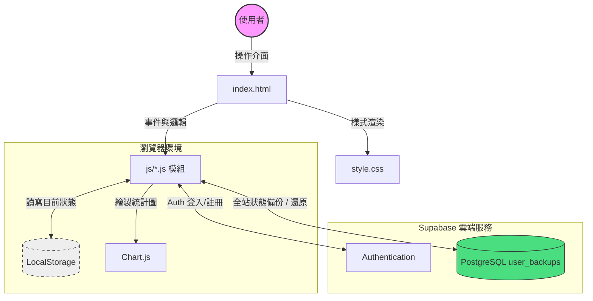
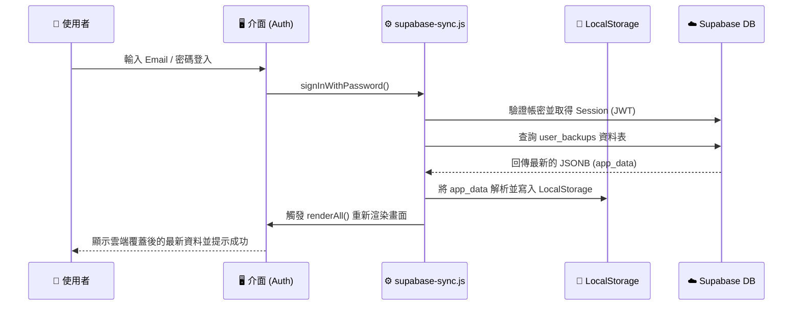

# 📊 收支與生活管理系統 (Expense & Life Manager) 系統文件

這是一份針對 **收支與生活管理工具** 的系統分析與開發文件。本系統為前端主導之應用程式，結合 localStorage 與 Supabase 輕量雲端備份，旨在協助用戶輕鬆管理固定支出、日常生活費、專案預算以及資產規劃。

---

## 1. 系統架構圖 (System Architecture)



---

## 2. 技術堆疊 (Tech Stack)

| 類別 | 技術/工具 | 說明 |
| :--- | :--- | :--- |
| **核心語言** | HTML5, CSS3, Vanilla JavaScript (ES6+) | 無採用大型前端框架，使用原生 JS 進行模組化開發 |
| **樣式設計** | Native CSS (Variables) | 透過 CSS 變數實現深色/淺色模式切換及 RWD 響應式設計 |
| **資料儲存 (地端)** | Web Storage API (LocalStorage) | 應用程式核心狀態，提供離線與快速存取體驗 |
| **資料儲存 (雲端)** | [Supabase](https://supabase.com/) | 提供使用者認證 (Auth) 及 PostgreSQL (備份 JSON 狀態) |
| **圖表繪製** | [Chart.js](https://www.chartjs.org/) | 繪製各分類支出圓餅圖、長條圖及近 6 個月趨勢圖 |
| **字體與圖示** | Google Fonts, Font Awesome | 提供 Noto Sans TC / Noto Serif TC 字體與 SVG 圖示 |

---

## 3. 功能模組詳解 (Features)

系統劃分為五大核心模組（分頁），涵蓋多面向的財務與生活管理：

### 3.1 生活費記帳 (Life Expenses)
*   **收支明細管理**：記錄每日支出與收入，依月份自由切換查看。
*   **分類預算控制**：可自訂收入/支出分類，並對單一分類設定「月預算」。
*   **月度總覽**：自動計算本月實際收入、支出與結餘，並透過進度條顯示花費比例。

### 3.2 收支分析 (Analysis)
*   **財務儀表板**：設定預估月收入，系統自動計算扣除固定與生活支出後的「每月結餘」。可選擇是否扣除專案預定金。
*   **圖表視覺化**：
    *   **訂閱分類分析**：包含年度預估總支出，圓餅圖/長條圖，支援按年/按月檢視固定支出。
    *   **生活費分類分析**：依月份檢視生活費各分類的佔比圓餅圖。
    *   **趨勢圖**：近 6 個月的總收支折線趨勢圖。

### 3.3 固定支出 (Fixed Expenses / Management)
*   **訂閱與分期管理**：新增、編輯、刪除(CRUD)固定支出或訂閱項目。
*   **多幣別與週期**：支援 TWD, USD, JPY 等自動轉換匯率，並可設定每月、每季、每半年、每年或單次繳費。狀態區分「進行中」或「已結束」。
*   **資料備份/匯出**：提供手動匯出/匯入全站備份 JSON 檔及清除所有資料功能。

### 3.4 資產試算 (Wealth Calculator)
*   **複利試算模型**：將資產劃分為「高風險(投資)」與「低風險(現金/活存)」兩大部位。
*   **目標預測**：輸入目標達成的總金額、當前資產、每月各部位投入與預估年化報酬/利率，自動繪製資產成長曲線圖並預估達成之年月與總投報率。

### 3.5 專案預算 (Projects / Events)
*   **獨立預算專案**：例如旅遊、購車等特定目標，可設定總預算與起訖日期。
*   **專案明細記帳**：在專案內獨立記錄各項花費，支援子分類，並顯示已花費與剩餘預算百分比。
*   **預備金扣除連動**：在分析看板中可連動扣除每月應存下的「專案預定金」，以反映真實的剩餘可用資金。

### 3.6 雲端同步 (Cloud Sync)
*   **簡單帳戶系統**：提供 Email 與密碼登入/註冊功能。
*   **自動備份與還原**：有登入的狀態下，任何資料或設定變更皆會自動打包 LocalStorage JSON 並上傳至 Supabase `user_backups` 表；登入時自動載入最新備份覆蓋本地。

---

## 4. 資料流流程圖 (Data Flow)

以下展示 **「登入並同步雲端資料」** 時處理流程：



---

## 5. 資料結構定義 (Data Schema)

### 5.1 Supabase Schema (PostgreSQL)
```sql
CREATE TABLE user_backups (
    user_id UUID REFERENCES auth.users(id) PRIMARY KEY,
    app_data JSONB NOT NULL,
    updated_at TIMESTAMP WITH TIME ZONE DEFAULT timezone('utc'::text, now()) NOT NULL
);

-- 並設定 Row Level Security (RLS) 確保用戶只能存取自己的備份
```

### 5.2 LocalStorage 狀態結構 (State)
系統的核心狀態 (即備份至雲端的 JSONB 內容) 大致包含以下結構：
```json
{
  "items": [ /* 固定支出項目陣列 (包含 name, category, amount, currency, cycle 等) */ ],
  "categories": [ /* 固定支出分類陣列 */ ],
  "lifeItems": [ /* 生活費收支紀錄陣列 (含 type: income/expense) */ ],
  "lifeCategories": [ /* 生活費分類陣列 (含 type, budget(月預算上限)) */ ],
  "projects": [ /* 獨立企劃專案陣列 (包含 budget, startDate, endDate, status) */ ],
  "projectItems": [ /* 專案明細紀錄陣列 (對照 project.id) */ ],
  "projectCategories": [ /* 專案明細分類陣列 */ ],
  "wealthParams": { /* 資產試算參數: investRate, cashCurrent, target 等 */ },
  "monthlyIncome": 50000, /* 預估月本薪/收入 */
  "deductProjectSavings": true /* 分析看板是否扣除專案預定金 */
}
```

---

## 6. 專案檔案結構 (File Structure)

```text
Project Root
├── index.html               # 應用程式入口 (包含 UI 骨架、分頁導航、Modals)
├── style.css                # 樣式機制 (包含 CSS 變數主題、RWD、組件樣式)
└── js/                      # 拆分模組化 JavaScript
    ├── state.js             # 應用程式狀態管理 (全域 state 物件宣告)
    ├── data.js              # LocalStorage 讀取/儲存、CRUD 核心資料處理
    ├── utils.js             # 共用工具函式 (UUID 生成、金額格式化)
    ├── supabase-config.js   # Supabase 初始化設定
    ├── supabase-sync.js     # Auth 認證與雲端備份同步邏輯
    ├── ui-fixed.js          # 「固定支出」分頁邏輯
    ├── ui-life.js           # 「生活費記帳」分頁邏輯
    ├── ui-analysis.js       # 「收支分析」分頁邏輯與 Chart.js 圖表繪製
    ├── ui-wealth.js         # 「資產試算」分頁邏輯
    ├── ui-projects.js       # 「專案預算」分頁邏輯
    └── main.js              # 全域事件綁定、初始化 (Tab 切換、主題切換等)
```

---

## 7. 未來擴充建議 (Possible Enhancements)
*   **PWA (Progressive Web App)**：支援安裝為桌面/手機應用程式，並配置 Service Worker 實行離線快取支援，提升行動端體驗。
*   **AI 記帳整合**：串接 LLM/Vision API (例如 Gemini)，實現上傳發票、收據或食物照片自動估算金額並登錄記帳。
*   **多裝置即時協作**：透過 Supabase Realtime Channel 訂閱資料庫變更事件，達到跨裝置開啟時自動即時推播並更新畫面。
*   **自動匯率更新**：整合公開匯率 API (Exchange Rates API)，定期自動更新外幣與台幣間轉換的匯率。
