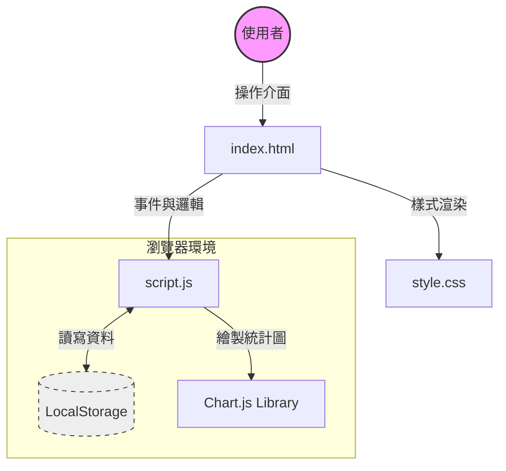
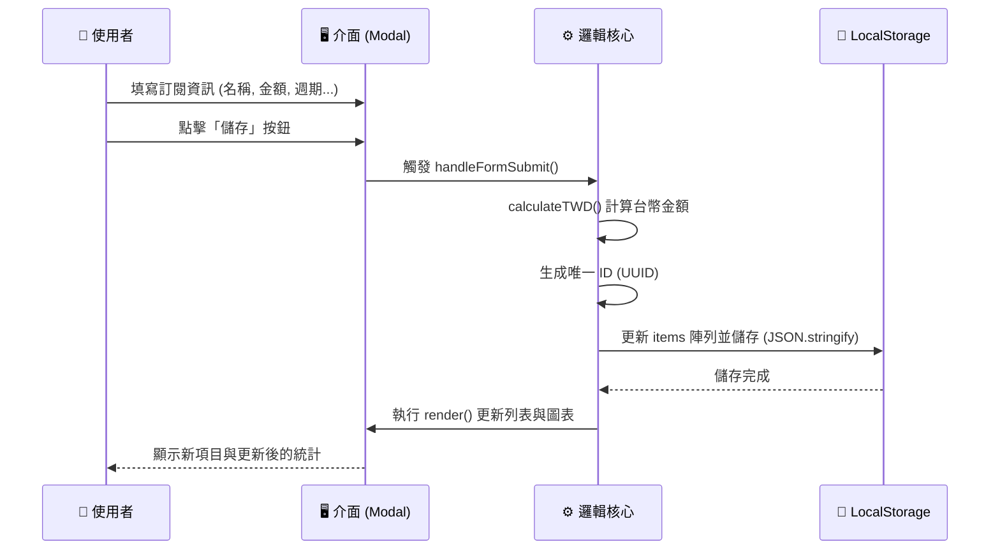

# 📊 訂閱管理工具 (Subscription Manager) 系統文件

這是一份針對 **訂閱與固定支出管理工具** 的系統分析與開發文件。本系統為純前端應用程式，旨在協助用戶輕鬆管理週期性支出。

---

## 1. 系統架構圖 (System Architecture)



---

## 2. 技術堆疊 (Tech Stack)

| 類別 | 技術/工具 | 說明 |
| :--- | :--- | :--- |
| **核心語言** | HTML5, CSS3, JavaScript (ES6+) | 無需依賴大型框架 (React/Vue/Angular) |
| **樣式設計** | Native CSS (Variables) | 透過 CSS 變數實現深色/淺色模式切換 |
| **資料儲存** | Web Storage API (LocalStorage) | 資料保留於用戶端，無後端伺服器依賴 |
| **圖表繪製** | [Chart.js](https://www.chartjs.org/) | 繪製年度支出佔比圓餅圖 (Pie Chart) |
| **字體與圖示** | [Google Fonts](https://fonts.google.com/), [Font Awesome](https://fontawesome.com/) | 提供 Noto Sans TC 字體與 SVG 圖示 |

---

## 3. 功能模組詳解 (Features)

### 3.1 核心功能

| 功能模組 | 詳細功能描述 | 備註 |
| :--- | :--- | :--- |
| **📝 訂閱項目** | 新增、編輯、刪除 (CRUD)、多幣別支援、自訂繳費週期 | 支援 TWD, USD, JPY 等，自動換算匯率 |
| **🏷️ 分類管理** | 自訂分類名稱、顏色標籤、分類拖曳排序 | 預設包含：娛樂、工作、生活、保險 |
| **📊 財務儀表板** | 每月固定支出統計、年度總預估、剩餘預算計算 | 需設定「預估月收入」以計算剩餘預算 |
| **📅 付款排程** | 以月份為單位的時間軸 (Timeline) 檢視 | 自動計算週期性付款日 |
| **💾 資料備份** | 匯出 (JSON)、匯入還原 | 支援跨裝置轉移資料 |

### 3.2 使用者體驗 (UX)
*   **深色模式 (Dark Mode)**: 支援手動切換與系統自動偵測。
*   **拖放排序 (Drag & Drop)**: 直覺的項目與分類重新排序功能。
*   **RWD 響應式設計**: 適配桌面與行動裝置螢幕。

---

## 4. 資料流流程圖 (Data Flow)

以下展示 **「新增訂閱項目」** 時的資料處理流程：



---

## 5. 資料結構定義 (Data Schema)

系統主要使用 `localStorage` 儲存兩大核心資料陣列：

### 5.1 `items` (訂閱項目)
```json
[
  {
    "id": "c7b3d8e0-5f1a-4b9e-9c3d-1a2b3c4d5e6f",
    "name": "Netflix",
    "categoryId": "cat_ent",
    "currency": "TWD",
    "originalAmount": 390,
    "exchangeRate": 1,
    "amount": 390,
    "cycle": "monthly",
    "startDate": "2023-01-01",
    "endDate": null,
    "note": "家庭方案",
    "createdAt": "2023-01-01T00:00:00.000Z"
  }
]
```

### 5.2 `categories` (分類標籤)
```json
[
  {
    "id": "cat_ent",
    "name": "娛樂",
    "color": "#8b5cf6"
  },
  {
    "id": "cat_work",
    "name": "工作",
    "color": "#3b82f6"
  }
]
```

---

## 6. 專案檔案結構 (File Structure)

```text
Project Root
├── index.html       # 應用程式入口 (UI 骨架)
├── style.css        # 樣式定義 (包含 Themes, Flex/Grid Layout)
└── script.js        # 核心邏輯 (Logic, Events, Storage)
```

---

## 7. 未來擴充建議 (Possible Enhancements)
*   **雲端同步**: 整合 Google Drive 或 Firebase 實現多裝置即時同步。
*   **通知提醒**: 整合瀏覽器 Notification API，在繳費日前發送通知。
*   **統計報表**: 增加「月度支出趨勢圖」以觀察支出變化。
