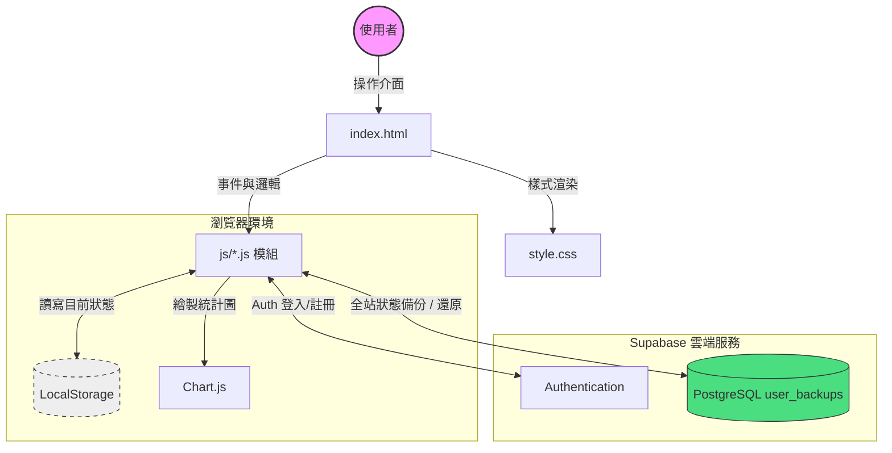
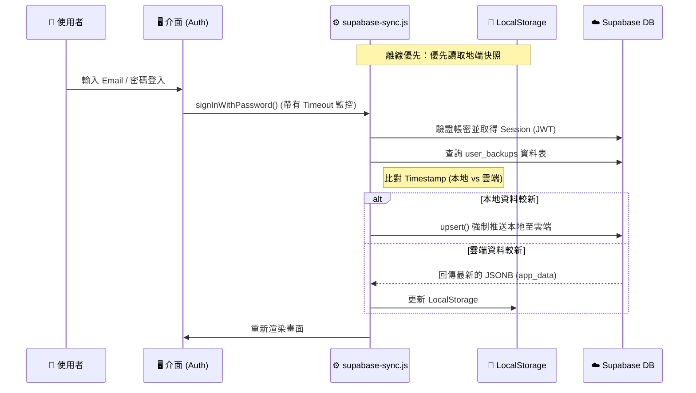

# 📊 收支與生活管理系統 (Expense & Life Manager) 系統文件

這是一份針對 **收支與生活管理工具** 的系統分析與開發文件。本系統為前端主導之應用程式，結合 localStorage 與 Supabase 輕量雲端備份，旨在協助用戶輕鬆管理固定支出、日常生活費、專案預算以及資產規劃。

---

## 1. 系統架構圖 (System Architecture)


```mermaid
graph TD
    User((使用者)) -->|操作介面| HTML[index.html]
    HTML -->|樣式渲染| CSS[style.css]
    HTML -->|事件與邏輯| JS[js/*.js 模組]
    
    subgraph Browser [瀏覽器環境]
        JS <-->|讀寫目前狀態| LS[(LocalStorage)]
        JS -->|繪製統計圖| ChartJS[Chart.js]
    end
    
    subgraph Cloud [Supabase 雲端服務]
        JS <-->|Auth 登入/註冊| SupabaseAuth[Authentication]
        JS <-->|全站狀態備份 / 還原| SupabaseDB[(PostgreSQL user_backups)]
    end

    style User fill:#f9f,stroke:#333,stroke-width:2px
    style LS fill:#eee,stroke:#333,stroke-dasharray: 5 5
    style SupabaseDB fill:#4ade80,stroke:#333
```

---

## 2. 技術堆疊 (Tech Stack)

| 類別 | 技術/工具 | 說明 |
| :--- | :--- | :--- |
| **核心語言** | HTML5, CSS3, Vanilla JavaScript (ES6+) | 無採用大型前端框架，使用原生 JS 進行模組化開發 |
| **樣式設計** | Native CSS (Variables) | 透過 CSS 變數實現深色/淺色模式切換及 RWD 響應式設計 |
| **資料儲存 (地端)** | Web Storage API (LocalStorage) | 應用程式核心狀態，提供離線與快速存取體驗 |
| **資料儲存 (雲端)** | [Supabase](https://supabase.com/) | 提供使用者認證 (Auth) 及 PostgreSQL (備份 JSON 狀態) |
| **圖表繪製** | [Chart.js](https://www.chartjs.org/) | 繪製各分類支出圓餅圖、長條圖及近 6 個月趨勢圖 |
| **匯率/股市 API** | Frankfurter & ExchangeRate API | 支援多國匯率即時與歷史查詢，並內建 404 備援Fallback機制 |

---

## 3. 功能模組詳解 (Features)

### 3.1 生活費記帳 (Life Expenses) - [2026/03 優化]
*   **整合式容器 (Shared Container)**：將「預算分類」與「收支明細」整合於同一個卡片容器中，透過頁籤切換，大幅優化行動裝置的垂直滑動體驗。
*   **常態支出 (Daily Expenses)**：支援設定固定頻率（每天、平日、假日）的自動化支出。系統會自動補齊過去日期的固定開銷，同時保留單次編輯的彈性。
*   **靈活排序**：明細列表支援一鍵切換「日期升冪/降冪」排列，方便回溯或檢視最新花費。
*   **分類預算控制**：可自訂分類顏色與月預算，並透過進度條直觀顯示各分類的消費佔比與剩餘額度。
*   **行動體驗優化**：針對長列表使用 `overscroll-behavior: contain` 確保容器內滑動不與外層頁面衝突。

### 3.2 收支分析 (Analysis)
*   **財務儀表板**：設定預估月收入，系統自動計算扣除固定與生活支出後的「每月結餘」。
*   **趨勢圖**：近 6 個月的總收支折線趨勢圖，視覺化財務健康狀況。

### 3.3 固定支出 (Fixed Expenses)
*   **訂閱管理**：管理循環扣款或分期項目，支援多幣別自動轉換。
*   **匯率Fallback**：當主要匯率API服務異常或假日無資料時，自動切換至備援API確保資料正確性。

### 3.4 資產試算 (Wealth Calculator)
*   **複利試算模型**：劃分投資與現金部位，支援台美股歷史 CAGR 自動搜尋帶入。
*   **實時同步**：可將生活費模組產生的實際月結餘自動帶入作為試算參數。

### 3.5 專案預算 (Projects)
*   **獨立專案管理**：針對特定事件（如旅遊）建立獨立帳本，預算不與日常支出混淆。

### 3.6 雲端同步與離線優先 (Cloud Sync & Offline-First) - [核心強化]
*   **超時防卡死 (Timeout Handling)**：在進行雲端 Auth 或資料拉取時加入 5-8 秒超時限制，確保在網路不佳或假性連線時，使用者仍能秒開 APP 使用本地資料。
*   **離線記帳 (Local-First)**：所有儲存動作優先寫入 LocalStorage。在無網路狀態下，APP 功能完全正常。
*   **衝突解決 (Conflict Resolution)**：系統會比對本地與雲端的 `last_local_update` 時間戳。若偵測到本地資料較新，系統會主動反向推播 (Push) 覆蓋雲端，確保離線記的帳不被抹除。
*   **自動重連同步**：監聽瀏覽器 `online` 事件，當網路恢復時自動觸發背景同步。

---

## 4. 資料流流程圖 (Data Flow)


```mermaid
sequenceDiagram
    participant User as 👤 使用者
    participant UI as 🖥️ 介面 (Auth)
    participant JS as ⚙️ supabase-sync.js
    participant LS as 💾 LocalStorage
    participant DB as ☁️ Supabase DB

    Note over JS, LS: 離線優先：優先讀取地端快照
    User->>UI: 輸入 Email / 密碼登入
    UI->>JS: signInWithPassword() (帶有 Timeout 監控)
    JS->>DB: 驗證帳密並取得 Session (JWT)
    JS->>DB: 查詢 user_backups 資料表
    Note right of JS: 比對 Timestamp (本地 vs 雲端)
    alt 本地資料較新
        JS->>DB: upsert() 強制推送本地至雲端
    else 雲端資料較新
        DB-->>JS: 回傳最新的 JSONB (app_data)
        JS->>LS: 更新 LocalStorage
    end
    JS->>UI: 重新渲染畫面
```

---

## 5. 資料結構定義 (Data Schema)

### 5.1 LocalStorage 狀態結構 (State)
```json
{
  "items": [ /* 固定支出項目 */ ],
  "lifeItems": [ /* 生活費紀錄，含 _autoDailyId 標記 */ ],
  "dailyExpenses": [ /* 常態支出設定：freq (everyday/weekdays/weekends) */ ],
  "wealthParams": { /* 投資參數 */ },
  "last_local_update": 1741343841000 /* 關鍵同步時間戳 */
}
```

---

## 6. 專案檔案結構 (File Structure)

與原架構一致，重點模組職責：
*   `js/supabase-sync.js`：核心同步與離線邏輯。
*   `js/ui-life.js`：生活費 UI 與常態支出自動帶入邏輯。
*   `js/utils.js`：包含快取機制與匯率備援邏輯。

---

## 7. 系統特色結語
本系統旨在提供**極速且可靠**的記帳體驗。透過「離線優先」設計與「自動化帶入（薪資/常態支出）」功能，將繁瑣的記帳動作降至最低，同時透過雲端同步確保數據跨裝置的安全與一致。
