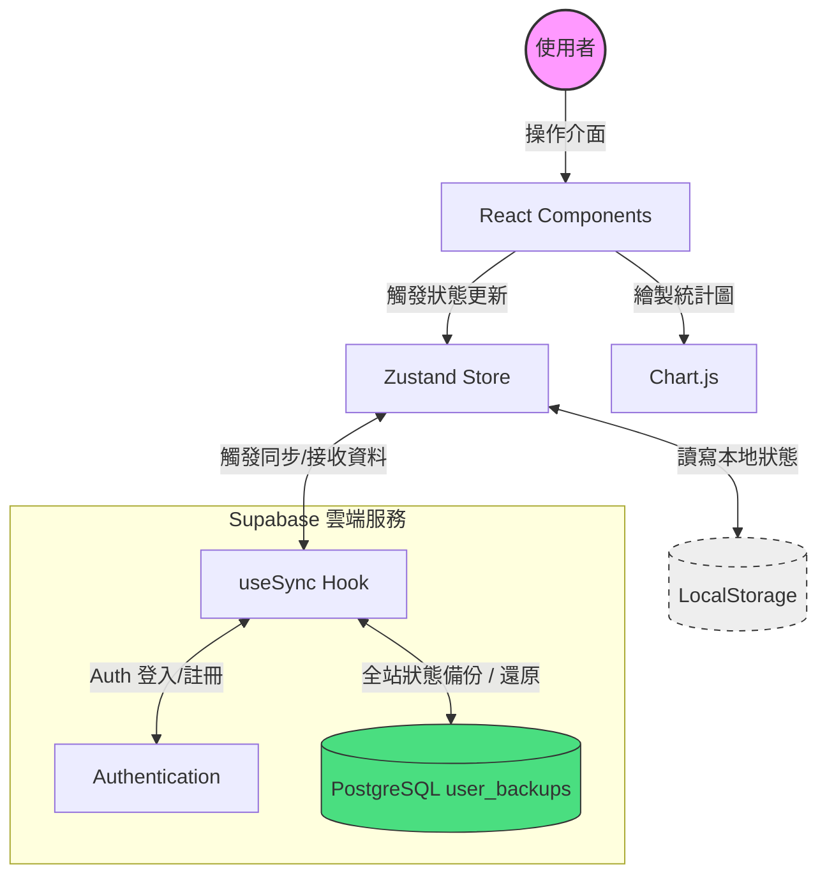
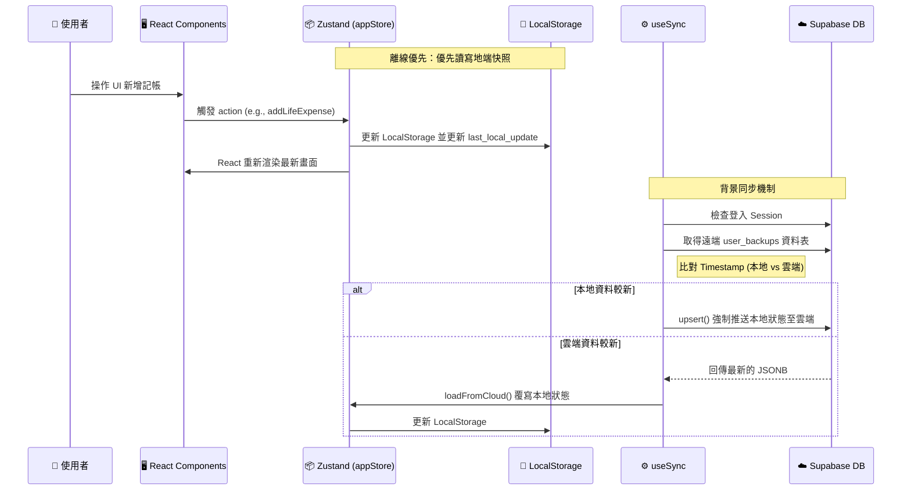

📊 收支與生活管理系統 (Expense & Life Manager) 系統文件

這是一份針對 收支與生活管理工具 的系統分析與開發文件。本系統為基於 **React** 與 **Vite** 構建之前端主導應用程式，透過 **Zustand** 進行狀態管理，並結合 LocalStorage 與 Supabase 輕量雲端備份，提供「離線優先」的無縫記帳體驗，旨在協助用戶輕鬆管理固定支出、日常生活費、專案預算以及資產規劃。

## 1. 系統架構圖 (System Architecture)


```mermaid
graph TD
    User((使用者)) -->|操作介面| React[React Components]
    React -->|觸發狀態更新| Zustand[Zustand Store]
    Zustand <-->|讀寫本地狀態| LS[(LocalStorage)]
    React -->|繪製統計圖| ChartJS[Chart.js]

    subgraph Cloud [Supabase 雲端服務]
        SyncHook[useSync Hook] <-->|Auth 登入/註冊| SupabaseAuth[Authentication]
        SyncHook <-->|全站狀態備份 / 還原| SupabaseDB[(PostgreSQL user_backups)]
    end

    Zustand <-->|觸發同步/接收資料| SyncHook

    style User fill:#f9f,stroke:#333,stroke-width:2px
    style LS fill:#eee,stroke:#333,stroke-dasharray: 5 5
    style SupabaseDB fill:#4ade80,stroke:#333
```

## 2. 技術堆疊 (Tech Stack)

| 類別 | 技術/工具 | 說明 |
| :--- | :--- | :--- |
| **核心語言** | JavaScript (ES6+), JSX | 採用最新 JS 語法搭配 JSX 開發 UI |
| **框架與建置** | React 19, Vite 6 | 高效能前端組件化框架與極速建置工具 |
| **狀態管理** | Zustand 5 | 輕量、快速的全域狀態管理庫，封裝 LocalStorage 讀寫邏輯 |
| **樣式設計** | Native CSS (Variables) | 透過 CSS 變數實現深色/淺色模式切換及 RWD 響應式設計 |
| **資料儲存 (地端)** | Web Storage API (LocalStorage) | 應用程式核心狀態，提供離線與快速存取體驗 (透過 Zustand 同步) |
| **資料儲存 (雲端)** | Supabase JS 2 | 提供使用者認證 (Auth) 及 PostgreSQL (備份 JSON 狀態) |
| **圖表繪製** | Chart.js 4 | 繪製各分類支出圓餅圖、長條圖及近 6 個月趨勢圖 |

## 3. 功能模組詳解 (Features)

### 3.1 生活費記帳 (Life Expenses)
- **整合式容器 (Shared Container)：** 將「預算分類」與「收支明細」整合於同一個卡片容器，透過頁籤切換，優化行動裝置垂直滑動體驗。
- **常態支出 (Daily Expenses)：** 支援設定固定頻率（每天、平日、假日）自動化支出。系統自動補齊過去日期固定開銷，保留單次編輯彈性。
- **靈活排序：** 明細列表支援一鍵切換「日期升冪/降冪」排列，方便回溯或檢視最新花費。
- **分類預算控制：** 可自訂分類顏色與月預算，透過進度條直觀顯示各分類消費佔比與剩餘額度。

### 3.2 收支分析 (Analysis)
- **財務儀表板：** 設定預估月收入，系統自動計算扣除固定與生活支出後的「每月結餘」。
- **趨勢圖：** 近 6 個月總收支折線趨勢圖，視覺化財務健康狀況。

### 3.3 固定支出 (Fixed Expenses)
- **訂閱管理：** 管理循環扣款或分期項目，支援多幣別自動轉換。

### 3.4 資產試算 (Wealth Calculator)
- **複利試算模型：** 劃分投資與現金部位，支援台美股歷史 CAGR 自動搜尋帶入。
- **實時同步：** 生活費模組產生之實際月結餘可自動帶入作為試算參數。

### 3.5 專案預算 (Projects)
- **獨立專案管理：** 針對特定事件建立獨立帳本，預算不與日常支出混淆。

### 3.6 雲端同步與離線優先 (Cloud Sync & Offline-First) [核心強化]
- **離線記帳 (Local-First)：** 所有的 UI 狀態寫入優先儲存至 Zustand Store 並同步至 LocalStorage。無網路狀態下功能完全正常。
- **衝突解決 (Conflict Resolution)：** 比對本地與雲端 `last_local_update` 時間戳。若本地資料較新則主動推播 (Push) 覆蓋雲端，防止離線紀錄遭抹除。
- **自動重連同步：** 搭配 React Hook (`useSync.js`) 監聽狀態，網路恢復時自動觸發背景同步。

## 4. 資料流流程圖 (Data Flow)


```mermaid
sequenceDiagram
    participant User as 👤 使用者
    participant UI as 🖥️ React Components
    participant Store as 📦 Zustand (appStore)
    participant LS as 💾 LocalStorage
    participant Hook as ⚙️ useSync
    participant DB as ☁️ Supabase DB

    Note over Store, LS: 離線優先：優先讀寫地端快照
    User->>UI: 操作 UI 新增記帳
    UI->>Store: 觸發 action (e.g., addLifeExpense)
    Store->>LS: 更新 LocalStorage 並更新 last_local_update
    Store->>UI: React 重新渲染最新畫面

    Note over Hook, DB: 背景同步機制
    Hook->>DB: 檢查登入 Session
    Hook->>DB: 取得遠端 user_backups 資料表
    Note right of Hook: 比對 Timestamp (本地 vs 雲端)
    alt 本地資料較新
        Hook->>DB: upsert() 強制推送本地狀態至雲端
    else 雲端資料較新
        DB-->>Hook: 回傳最新的 JSONB
        Hook->>Store: loadFromCloud() 覆寫本地狀態
        Store->>LS: 更新 LocalStorage
    end
```

## 5. 資料結構定義 (Data Schema)

```json
{
  "items": [ /* 固定支出項目 */ ],
  "lifeItems": [ /* 生活費紀錄，含 _autoDailyId 標記 */ ],
  "dailyExpenses": [ /* 常態支出設定：freq (everyday/weekdays/weekends) */ ],
  "wealthParams": { /* 投資參數 */ },
  "last_local_update": 1741343841000
}
```

## 6. 專案檔案結構 (File Structure)

全新的 React 模組化結構：

- `src/main.jsx`: 應用程式進入點。
- `src/App.jsx`: 主應用程式容器與全域頁籤邏輯。
- `src/store/appStore.js`: **核心狀態管理 (Zustand)**，集中所有 LocalStorage 讀寫邏輯與資料更新 action。
- `src/hooks/useSync.js`: **核心同步邏輯**，封裝 Supabase 的雲端互動與離線衝突解決。
- `src/components/`:
  - `layout/`: 共用版面組件 (Header, BottomNav, AuthModal 等)。
  - `tabs/`: 各功能主頁面模組 (LifeTab, FixedTab, AnalysisTab 等)。
  - `ui/`: 可重用之基礎 UI 元件與動畫組件。
  - `modals/`: 彈出式對話框。
- `src/lib/`:
  - `supabaseClient.js`: Supabase 連線實例。
  - `constants.js`: 全域常數設定。
  - `utils.js`: 共用工具函式。
- `css/`: 全局樣式定義 (依賴 Native CSS 變數)。

## 7. 系統特色結語

本系統經歷架構升級，現已採用 **React** 的組件化架構與 **Zustand** 的輕量狀態管理，進一步強化了「離線優先」策略。這不僅確保了操作與記帳體驗極致流暢且不中斷，更透過 Supabase 的背景同步機制，完美解決多裝置間的資料落差，兼具地端極速存取效能與雲端資料的彈性與安全性。